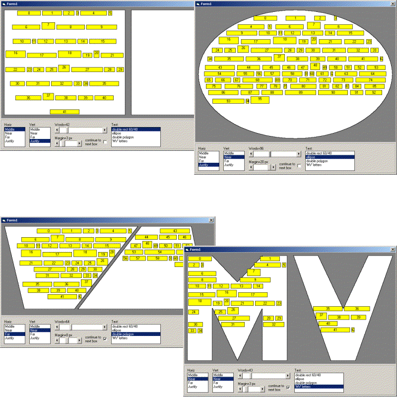



## Text wrapping algorithm inside arbitrary regions

### Description

Not an application itself, but it helps a lot if you have to manage the position of the words of a text insise an arbitrary shape.

There are the basic aligments, horizontally and vertically, and the ability to manage the overflow of a region continuing on a next one.

Only for bad people!

Have fun...
 
### More Info
 

             |
---                |---
**Submitted On**   |2006-06-15 17:50:26
**By**             |[Mario Vernari](https://github.com/Planet-Source-Code/PSCIndex/blob/master/ByAuthor/mario-vernari.md)
**Level**          |Advanced
**User Rating**    |4.8 (19 globes from 4 users)
**Compatibility**  |VB 6\.0
**Category**       |[Miscellaneous](https://github.com/Planet-Source-Code/PSCIndex/blob/master/ByCategory/miscellaneous__1-1.md)
**World**          |[Visual Basic](https://github.com/Planet-Source-Code/PSCIndex/blob/master/ByWorld/visual-basic.md)
**Archive File**   |[Text\_wrapp2001176162006\.zip](https://github.com/Planet-Source-Code/mario-vernari-text-wrapping-algorithm-inside-arbitrary-regions__1-65678/archive/master.zip)

